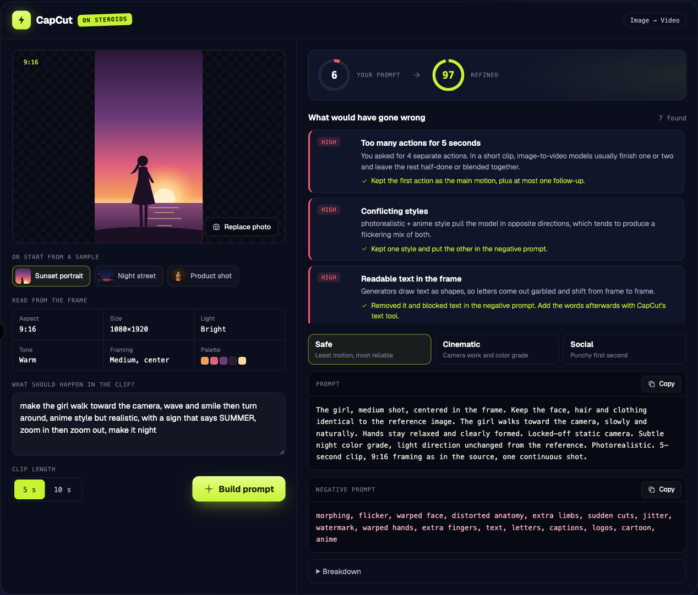

# CapCut on Steroids

**A Claude skill that turns a photo and a rough idea into an image-to-video prompt CapCut is hard to misread.**

[Try it in the browser](https://aleksns.com/projects/capcut-on-steroids) · [How it works](#how-it-works) · [Install](#install)



AI video generators fail in predictable ways: too many actions for a short clip, styles that fight each other, text that comes out garbled, lighting the photo doesn't have. This skill reads your photo, checks your request against **14 known failure patterns**, and writes a structured prompt, a negative prompt and three variants: Safe, Cinematic and Social.

## Example

**Photo:** a girl standing on a beach at sunset, vertical 9:16.

**Request:**

> make the girl walk toward the camera, wave and smile then turn around, anime style but realistic, with a sign that says SUMMER, zoom in then zoom out, make it night

**Clarity score:** 6 → **97**

| Severity | What would have gone wrong | What changed |
|---|---|---|
| High | 4 actions in a 5-second clip | Kept one main motion |
| High | Anime and photorealistic at once | Kept photorealistic, blocked anime |
| High | Readable text on a sign | Removed; add it later with CapCut's text tool |
| Medium | Night requested on a bright photo | Subtle night grade, light direction kept |
| Medium | Waving hands | Asked for relaxed, clearly formed hands |
| Medium | Zoom in and zoom out in one shot | Kept a single camera move |
| Medium | Camera and subject both moving | Locked the camera in the Safe variant |

**Prompt (Safe variant):**

> The girl, medium shot, centered in the frame. Keep the face, hair and clothing identical to the reference image. The girl walks toward the camera, slowly and naturally. Hands stay relaxed and clearly formed. Locked-off static camera. Subtle night color grade, light direction unchanged from the reference. Photorealistic. 5-second clip, 9:16 framing as in the source, one continuous shot.

**Negative prompt:**

> morphing, flicker, warped face, distorted anatomy, extra limbs, sudden cuts, jitter, watermark, warped hands, extra fingers, text, letters, captions, logos, cartoon, anime

## Install

### Claude Code

```bash
git clone https://github.com/aleksns/capcut-on-steroids.git
cp -r capcut-on-steroids/capcut-on-steroids ~/.claude/skills/
```

Start a new session, attach a photo and run:

```
/capcut-on-steroids she turns toward the camera and smiles, slow push-in, golden hour
```

Add `duration=10` for a 10-second clip.

### Claude.ai

Zip the `capcut-on-steroids` folder and upload it under **Settings → Capabilities → Skills**.

### Any other LLM

Paste [`SKILL.md`](capcut-on-steroids/SKILL.md) and the two files in [`references/`](capcut-on-steroids/references) into the system prompt.

## How it works

1. **Read.** Describe the frame: subject, framing, position, light, palette and image quality.
2. **Parse.** Split the request into subject, actions, camera, light, style, pace and target platform.
3. **Lint.** Check it against the [14 failure patterns](capcut-on-steroids/references/failure-patterns.md) and fix what the prompt can fix.
4. **Compose.** Write the prompt in a [fixed order](capcut-on-steroids/references/prompt-template.md): subject → identity → motion → camera → light → style → timing.

## Limits

No prompt guarantees a generation. This skill reduces the common failures and explains why. The rules are based on how image-to-video models generally behave, not on CapCut internals.

## License

[MIT](LICENSE) © Aleksandr Nazarov
